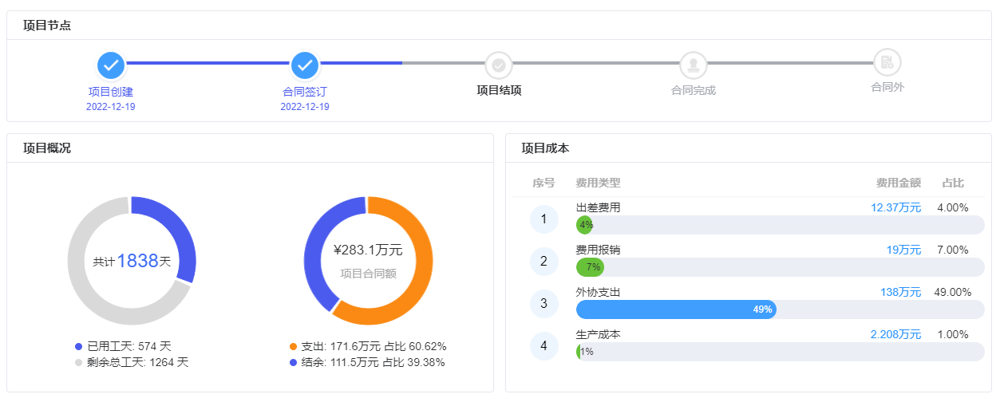

# 天润科技web前端机试题 - 2024版

## 要求

项目采用Vite + Vue 3，包管理器为pnpm。UI框架可选Element Plus或其他熟悉的框架

内容为实现一个布局, 尽量还原设计稿。图标可用开源矢量图标替代。需注重代码质量和响应式设计。祝顺利完成测试！🚀

1. 删除vite模板产生的无用代码, 创建组件OverPanel.vue

2. 在其中实现上图所示的布局

##  以下为可选需求

可选根据个人能力其中的条目来实现

功能实现要求 🚀

1. 响应式布局 📱💻
    - 实现宽度范围880px至1920px的响应式实现
    - 确保元素在不同宽度下均匀分布，保持良好的视觉效果

2. 数据加载与展示 🔄📊
    - 使用AJAX或Fetch API从`/public/mock-data.json`加载数据
    - 将获取的数据动态填充到页面中
    - 确保JSON数据更新后，刷新页面能反映最新内容

3. 暗色模式适配 🌓
    - 实现并优化暗色模式下的界面展示
    - 确保色彩对比度和可读性在暗色模式下仍然良好

4. 交互动画设计 ✨🖱️
    - 为适当的元素添加鼠标悬停（hover）效果
    - 设计并实现页面元素的入场动画
    - 可灵活运用CSS动画或JavaScript动画库
   
5. 使用git进行开发进度管理, 参考 https://segmentfault.com/a/1190000039056198 的规范进行提交

6. 使用bem方式对元素进行命名, 参考: https://www.bemcss.com/

注：请在实现过程中注重代码质量和性能优化。祝coding愉快！👨‍💻👩‍💻

